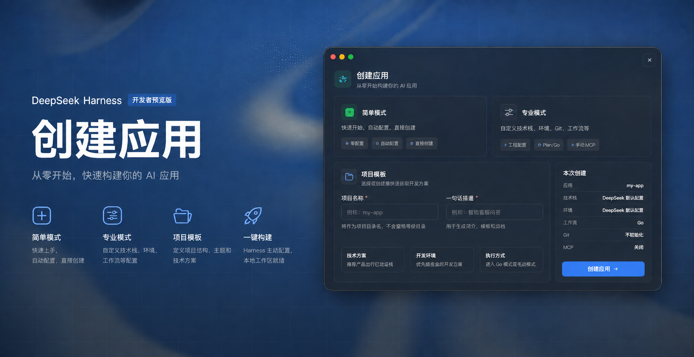

# EasyCode

<p align="center">
  <a href="https://github.com/TreasureGooldove/dsh-easycode/actions/workflows/ci.yml"></a>
  
    <a href="https://github.com/TreasureGooldove/dsh-easycode"></a>
  
  <a href="LICENSE"></a>
</p>


把“我想做一个……”压缩成一张表单。

<p align="center">
  
</p>


EasyCode 是  [DeepSeek Harness](https://github.com/deepseek-ai/deepseek-harness)  的应用起步器。它不要求用户先研究脚手架命令，而是收集项目名称、需求和工程偏好，在本机准备好工作区，再让当前 Harness 会话里的 DeepSeek 接着完成开发。

版本 `0.1.0` · Node.js 22+ · [MIT](LICENSE)


## 30 秒启动

```bash
dsh plugin --profile web add github:TreasureGooldove/dsh-easycode
dsh --profile web
```

打开 Harness Web 页面，从首页侧栏或「设置 → EasyCode」进入。

GitHub 仓库已经带上编译后的插件文件，所以安装过程不会触发 `prepare`，也不用添加 pnpm `allowBuilds`。

## 为什么需要它

一个新项目真正开始写代码前，通常要先回答这些问题：

- 用什么技术栈？
- 在本机、容器还是远程环境开发？
- 先规划，还是直接动手？
- 要不要初始化 Git？
- 有没有必须遵守的设计目标或 MCP 配置？

EasyCode 把这些答案写成 DeepSeek 能持续读取的项目上下文。没有指定的部分由 DeepSeek 判断；已经指定的部分会成为开发约束。

## 两档控制粒度

### 简易模式：我只讲需求

填写项目名称和一句话主题，然后创建。

EasyCode 会采用以下默认值：

- 技术栈：交给 DeepSeek。
- 开发环境：交给 DeepSeek。
- 工作流：Go。
- Git：关闭。
- MCP：关闭。

适合验证想法、制作小工具或快速拿到第一版。

### 专业模式：我来定规则

专业模式把工程选择展开。每一项都可以明确指定，也可以继续留给 DeepSeek。

<details>
<summary><strong>可选技术栈</strong></summary>

| 方向 | 选项 |
| --- | --- |
| Web 前端 | Vanilla、React、Vue、Svelte、SolidJS、Angular、Astro、Qwik |
| Web 全栈 | Next.js、Nuxt、Remix、SvelteKit、TanStack Start |
| JavaScript 服务端 | Node.js、Express、Fastify、NestJS、Hono、Bun、Deno |
| Python | FastAPI、Django |
| 其他服务端 | Go、Axum、Spring Boot、Ktor、.NET、Laravel、Rails |
| 客户端与扩展 | Electron、Tauri、React Native、Expo、Flutter、浏览器扩展 |
| 自定义 | 输入任意名称，或让 DeepSeek 选择 |

React + Vite、Vue + Vite、Next.js、Node.js API 和 Vanilla + Vite 可以直接生成起始结构。其余选项会进入项目约束，由 DeepSeek 在会话中补全实现。

</details>

<details>
<summary><strong>可选开发环境</strong></summary>

本地开发、Docker、Podman、Dev Container、WSL、Nix、远程 SSH、GitHub Codespaces、Kubernetes、自定义环境，或者由 DeepSeek 判断。

</details>

<details>
<summary><strong>工作流与附加选项</strong></summary>

- **Plan**：把本轮重点放在需求、架构、步骤和验收条件上。
- **Go**：要求 DeepSeek 继续产出可运行代码并执行检查。
- **Git**：创建以 `main` 为首分支的本地仓库。
- **设计目标**：单独记录体验、视觉、性能或工程质量要求。
- **MCP**：写入用户已经确认的 MCP 配置。

</details>

自动寻找 MCP 目前只是界面中的 WIP 选项。`v0.1` 不会联网寻找 MCP，也不会替用户安装相关软件包。

## 从表单到开发会话

```text
填写需求
  → 校验全部选项
  → 在临时位置生成项目
  → 发布到目标目录
  → 建立 Harness 工作区和会话
  → 发送 Plan 或 Go 任务给 DeepSeek
```

模型、凭据和会话仍由 Harness 管理。EasyCode 只负责把项目准备好，并完成第一次任务交接。

## 你会拿到什么

项目默认位于：

```text
$DSH_HOME/easycode-projects/<project-name>
```

除了技术栈对应的起始文件，目录中还会出现：

| 文件 | 给谁看 | 记录什么 |
| --- | --- | --- |
| `README.md` | 开发者 | 项目目标、方案和启动方法 |
| `PLAN.md` | 开发者与 DeepSeek | 实施步骤、限制和完成标准 |
| `EASYCODE.md` | DeepSeek | 本次创建时确定的稳定背景信息 |
| `.easycode/config.json` | EasyCode | 表单选项的机器可读版本 |
| `.mcp.json` | Harness / MCP 客户端 | 用户主动提供的 MCP 配置 |

`.mcp.json` 只会在手动开启 MCP 时生成。

## 它不会替你做什么

- 不覆盖已经存在的同名目录。
- 不在输出根目录之外写项目文件。
- 不创建远程 Git 仓库，不提交，也不推送。
- 不自动下载或安装 MCP。
- 不把生成的项目上传到外部服务。
- 不绕过 Harness 单独调用模型。

项目会先写入临时目录，所有步骤完成后再一次性移动到最终位置。请求大小限制为 64 KB，路径、枚举、自定义文本和 MCP 数据都会在 Host 端重新检查。

## 更换输出目录

在 profile 或 `$DSH_HOME/cordis.patch.yml` 中覆盖 `easycode` 配置：

```yaml
- id: easycode
  name: dsh-easycode
  config:
    outputRoot: '/absolute/path/to/projects'
```

这里需要提供完整的 `config`；Harness 不会把它与默认值逐字段合并。

## 维护与开发

```bash
npm install
npm run check
```

检查命令会运行 TypeScript 类型检查、20 项测试、生产构建和安装包内容校验。

```text
src/
├── client/          创建界面与 Harness 会话衔接
├── http.ts          创建请求入口
├── scaffolder.ts    文件落盘和 Git 初始化
├── templates.ts     起始文件与上下文模板
├── types.ts         Host / Web 共用类型
└── validation.ts    输入规则
```

`lib/` 是 Git 安装需要的预构建产物。修改源码并执行构建后，需要同时提交对应的 `lib/` 变化。其他约定见 [CONTRIBUTING.md](CONTRIBUTING.md)。

## 当前边界

- 已有：双模式、35+ 技术栈、丰富开发环境、Plan / Go、Git、手动 MCP、首页入口。
- 下一步：生成后检查、创建记录、可复用预设。
- 暂不提供：自动发现和安装 MCP。

---

EasyCode 由社区独立开发，与 DeepSeek 官方不存在隶属关系。
